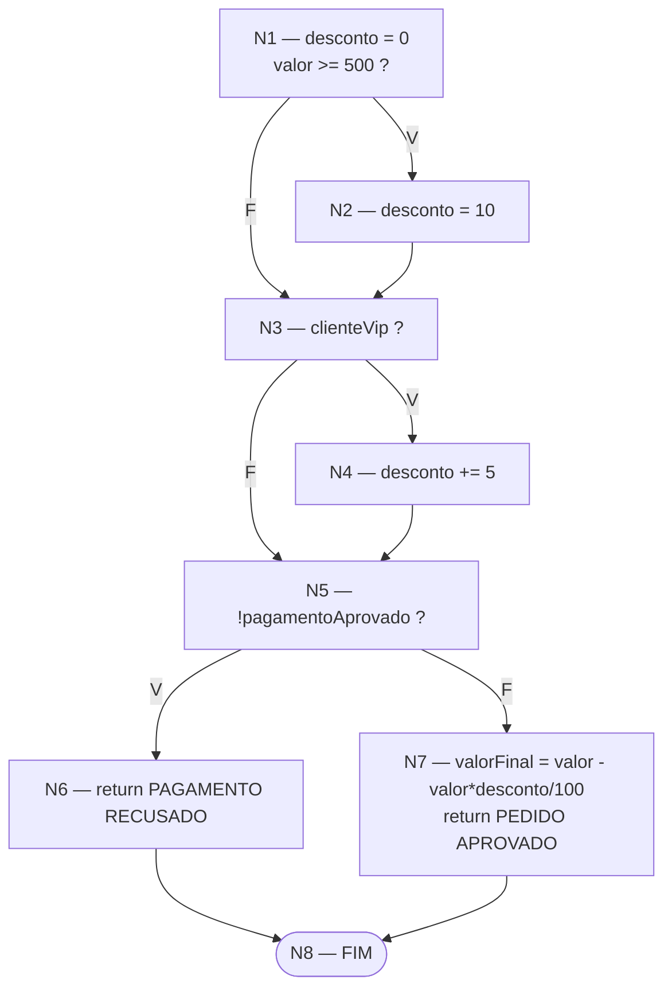
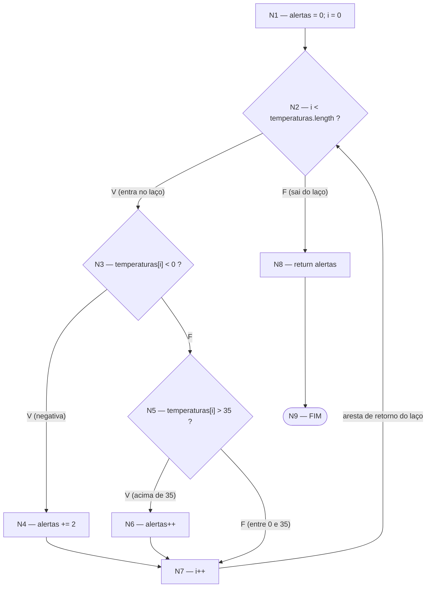

# Exercícios — Grafo de Fluxo de Controle (SEMANA07_REVISAO)

**Integrantes**

- Samuel Fuentes Michels — RA 24011114-2
- Felipe de Almeida Matrone — RA 24051005-2

Enunciado original: `aulas/SEMANA07_REVISAO/exercicios_grafos_fluxo_controle.md`
do repositório da disciplina.

## Convenções usadas nos dois exercícios

- **Bloco básico**: sequência máxima de instruções sem desvio de entrada nem de saída.
  Termina quando aparece uma decisão, um `return` ou o destino de um salto.
- **Saída unificada**: todo `return` liga-se a um único nó **FIM**. Sem isso o grafo teria
  várias saídas e `V(G) = E − N + 2` não valeria.
- **Decisão**: nó com duas arestas de saída, rotuladas **V** (verdadeira) e **F** (falsa).
- Um caminho só entra na base se acrescentar **pelo menos uma aresta** ainda não usada
  pelos caminhos anteriores.

---

# Exercício 1 — Classificação de pedido

```java
public String classificarPedido(double valor, boolean clienteVip, boolean pagamentoAprovado) {
    double desconto = 0;
    if (valor >= 500)        { desconto = 10; }
    if (clienteVip)          { desconto += 5; }
    if (!pagamentoAprovado)  { return "PAGAMENTO RECUSADO"; }
    double valorFinal = valor - (valor * desconto / 100);
    return "PEDIDO APROVADO: " + valorFinal;
}
```

## 1. Blocos básicos

| Nó | Conteúdo | Tipo |
| --- | --- | --- |
| **N1** | `desconto = 0;` e avaliação de `valor >= 500` | decisão **D1** |
| **N2** | `desconto = 10;` | processamento |
| **N3** | avaliação de `clienteVip` | decisão **D2** |
| **N4** | `desconto += 5;` | processamento |
| **N5** | avaliação de `!pagamentoAprovado` | decisão **D3** |
| **N6** | `return "PAGAMENTO RECUSADO";` | saída antecipada |
| **N7** | `valorFinal = valor − (valor * desconto / 100);` e `return "PEDIDO APROVADO: …"` | saída normal |
| **N8** | **FIM** (saída unificada) | fim |

A atribuição `desconto = 0` não forma um bloco separado porque não há desvio entre ela e a
primeira condição: as duas instruções sempre executam juntas.

## 2. Decisões

| Decisão | Nó | Condição | Saída V | Saída F |
| --- | --- | --- | --- | --- |
| D1 | N1 | `valor >= 500` | N2 | N3 |
| D2 | N3 | `clienteVip` | N4 | N5 |
| D3 | N5 | `!pagamentoAprovado` | N6 | N7 |

São **três decisões**, todas simples — não há `&&` nem `||`, então nenhuma delas precisa
ser quebrada em nós de curto-circuito.

## 3. Grafo de Fluxo de Controle



Representação em texto, para quem não renderizar o diagrama:

```
N1 --V--> N2 --> N3
N1 --F--> N3
N3 --V--> N4 --> N5
N3 --F--> N5
N5 --V--> N6 --> N8
N5 --F--> N7 --> N8
```

## 4. O encerramento antecipado

O `return` dentro da terceira condição é a aresta **N5 →(V) N6 → N8**. Ela desvia o fluxo
direto para o FIM, **sem passar por N7**. Consequência estrutural: N7 fica inalcançável
sempre que `pagamentoAprovado` for falso, e o método passa a ter dois pontos de saída
(N6 e N7) unificados em N8.

## 5. Contagem

**Nós (N = 8):** N1, N2, N3, N4, N5, N6, N7, N8

**Arestas (E = 10):**

| # | Aresta | Rótulo |
| --- | --- | --- |
| 1 | N1 → N2 | V |
| 2 | N1 → N3 | F |
| 3 | N2 → N3 | — |
| 4 | N3 → N4 | V |
| 5 | N3 → N5 | F |
| 6 | N4 → N5 | — |
| 7 | N5 → N6 | V |
| 8 | N5 → N7 | F |
| 9 | N6 → N8 | — |
| 10 | N7 → N8 | — |

## 6. Complexidade ciclomática

```
V(G) = E − N + 2 = 10 − 8 + 2 = 4
```

## 7. Conferência

```
V(G) = número de decisões + 1 = 3 + 1 = 4   ✔
```

Os dois cálculos coincidem, como esperado para um grafo conectado com saída unificada e
decisões apenas binárias.

## 8, 9 e 10. Base de caminhos independentes, dados e resultados

| # | Caminho | Aresta nova que justifica | `valor` | `clienteVip` | `pagamentoAprovado` | Desconto | Resultado esperado |
| --- | --- | --- | --- | --- | --- | --- | --- |
| **C1** | N1→N3→N5→N7→N8 | caminho base | `100` | `false` | `true` | 0% | `PEDIDO APROVADO: 100.0` |
| **C2** | N1→N2→N3→N5→N7→N8 | N1→N2 e N2→N3 | `500` | `false` | `true` | 10% | `PEDIDO APROVADO: 450.0` |
| **C3** | N1→N3→N4→N5→N7→N8 | N3→N4 e N4→N5 | `100` | `true` | `true` | 5% | `PEDIDO APROVADO: 95.0` |
| **C4** | N1→N3→N5→N6→N8 | N5→N6 e N6→N8 | `100` | `false` | `false` | — | `PAGAMENTO RECUSADO` |

A base tem exatamente **4 caminhos**, igual a `V(G)`, e cada um acrescenta ao menos uma
aresta inédita. Juntos, os quatro percorrem as 10 arestas do grafo.

Caso adicional útil (não pertence à base, pois não acrescenta aresta nova, mas exercita a
combinação das duas primeiras decisões):

| `valor` | `clienteVip` | `pagamentoAprovado` | Desconto | Resultado esperado |
| --- | --- | --- | --- | --- |
| `500` | `true` | `true` | 15% | `PEDIDO APROVADO: 425.0` |

Valor-limite recomendado: `valor = 499` (F em D1) contra `valor = 500` (V em D1) — é o par
que detecta a troca de `>=` por `>`.

## Questões para discussão

**Quantas combinações entre as três condições são possíveis?**
São três condições booleanas independentes, logo **2³ = 8 combinações**.

**O número de combinações é igual à complexidade ciclomática? Explique.**
Não: 8 ≠ 4. A complexidade ciclomática mede o tamanho de uma **base** de caminhos
linearmente independentes, não a quantidade de caminhos completos. As combinações crescem
pelo **produto** das decisões (2 × 2 × 2), enquanto a base cresce pela **soma**
(decisões + 1). Em outras palavras, `V(G)` é o número mínimo de caminhos necessários para
cobrir todas as arestas; as 8 combinações são o conjunto de todos os caminhos possíveis, e
as 4 restantes são combinações lineares das quatro da base.

**Como o `return` dentro da terceira condição altera o grafo?**
Ele cria um segundo ponto de saída. Sem o `return`, N5 seria uma decisão cujos dois ramos
voltariam a se juntar antes de N7; com ele, o ramo verdadeiro salta direto para o FIM. Isso
torna N7 inalcançável naquele caminho e obriga o grafo a ter saída unificada (N8) para que
`E − N + 2` continue válido.

**É possível executar o cálculo de `valorFinal` quando o pagamento não foi aprovado?**
Não. O cálculo está em N7 e a única aresta que chega a N7 é a saída **falsa** de D3. Com
`pagamentoAprovado == false`, a condição `!pagamentoAprovado` é verdadeira e o fluxo sai
por N6. O desconto chega a ser calculado (N1–N4 já executaram), mas é descartado — é
trabalho perdido, e um bom candidato a refatoração se a avaliação do pagamento fosse cara.

---

# Exercício 2 — Análise de leituras de temperatura

```java
public int contarAlertas(double[] temperaturas) {
    int alertas = 0;
    int i = 0;
    while (i < temperaturas.length) {
        if (temperaturas[i] < 0)        { alertas += 2; }
        else if (temperaturas[i] > 35)  { alertas++; }
        i++;
    }
    return alertas;
}
```

## 1. Blocos básicos

| Nó | Conteúdo | Tipo |
| --- | --- | --- |
| **N1** | `alertas = 0; i = 0;` | inicialização |
| **N2** | avaliação de `i < temperaturas.length` | decisão **D1** (cabeçalho do laço) |
| **N3** | avaliação de `temperaturas[i] < 0` | decisão **D2** |
| **N4** | `alertas += 2;` | processamento |
| **N5** | avaliação de `temperaturas[i] > 35` | decisão **D3** (`else if`) |
| **N6** | `alertas++;` | processamento |
| **N7** | `i++;` | incremento / junção dos três ramos |
| **N8** | `return alertas;` | saída |
| **N9** | **FIM** | fim |

N1 é separado de N2 porque N2 é destino da aresta de retorno do laço — recebe fluxo de dois
lugares, então precisa iniciar um bloco próprio. N7 é separado porque é o ponto onde os
três ramos da seleção se juntam.

## 2. Decisões

| Decisão | Nó | Condição | Saída V | Saída F |
| --- | --- | --- | --- | --- |
| D1 | N2 | `i < temperaturas.length` (condição do `while`) | N3 (entra no laço) | N8 (sai do laço) |
| D2 | N3 | `temperaturas[i] < 0` (primeiro `if`) | N4 | N5 |
| D3 | N5 | `temperaturas[i] > 35` (`else if`) | N6 | N7 |

## 3. Grafo de Fluxo de Controle



## 4. O que o grafo precisa mostrar

- **Entrada no laço**: aresta `N2 →(V) N3`.
- **Três possibilidades de classificação**: `N3→N4` (negativa, +2), `N5→N6` (acima de 35,
  +1) e `N5→N7` (entre 0 e 35, inclusive, sem alerta).
- **Incremento de `i`**: nó N7, alcançado pelos três ramos.
- **Aresta de retorno**: `N7 → N2`, o que fecha o ciclo.
- **Saída do laço**: aresta `N2 →(F) N8`.

## 5. Contagem

**Nós (N = 9):** N1 … N9

**Arestas (E = 11):**

| # | Aresta | Rótulo |
| --- | --- | --- |
| 1 | N1 → N2 | — |
| 2 | N2 → N3 | V |
| 3 | N2 → N8 | F |
| 4 | N3 → N4 | V |
| 5 | N3 → N5 | F |
| 6 | N4 → N7 | — |
| 7 | N5 → N6 | V |
| 8 | N5 → N7 | F |
| 9 | N6 → N7 | — |
| 10 | N7 → N2 | retorno do laço |
| 11 | N8 → N9 | — |

## 6. Complexidade ciclomática pelas duas fórmulas

```
V(G) = E − N + 2 = 11 − 9 + 2 = 4
V(G) = número de decisões + 1 = 3 + 1 = 4     ✔
```

As três decisões são a do `while`, a do `if` e a do `else if`.

## 7, 8 e 9. Base de caminhos, vetores de entrada e retornos

| # | Caminho | Aresta nova que justifica | Vetor de entrada | Retorno |
| --- | --- | --- | --- | --- |
| **T1** | N1→N2→N8→N9 | N2→N8 (saída sem iterar) | `new double[] {}` | `0` |
| **T2** | N1→N2→N3→N4→N7→N2→N8→N9 | N3→N4, N4→N7, N7→N2 | `{ -5.0 }` | `2` |
| **T3** | N1→N2→N3→N5→N6→N7→N2→N8→N9 | N5→N6, N6→N7 | `{ 40.0 }` | `1` |
| **T4** | N1→N2→N3→N5→N7→N2→N8→N9 | N5→N7 | `{ 20.0 }` | `0` |

Quatro caminhos, igual a `V(G)`, cobrindo as 11 arestas.

**Valores-limite do intervalo "sem alerta"** (não pertencem à base, mas são os que pegam a
troca de `<` por `<=` e de `>` por `>=`):

| Vetor | Retorno | O que verifica |
| --- | --- | --- |
| `{ -0.1 }` | `2` | imediatamente abaixo de 0 |
| `{ 0.0 }` | `0` | limite inferior: `0 < 0` é falso |
| `{ 35.0 }` | `0` | limite superior: `35 > 35` é falso |
| `{ 35.1 }` | `1` | imediatamente acima de 35 |

**Várias iterações combinadas:**

| Vetor | Retorno | Composição |
| --- | --- | --- |
| `{ -5.0, 40.0, 20.0 }` | `3` | 2 (negativa) + 1 (acima de 35) + 0 (normal) |
| `{ -1.0, -2.0 }` | `4` | duas iterações pelo ramo negativo |
| `{ 0.0, 35.0 }` | `0` | duas iterações pelos limites, nenhum alerta |

## 10. Por que o retorno do laço precisa aparecer no CFG

Três motivos:

1. **Sem a aresta N7 → N2, o grafo seria acíclico** e representaria um programa que executa
   o corpo no máximo uma vez — deixaria de descrever o código.
2. **A complexidade cairia para 3** (`E = 10`, `N = 9` → `10 − 9 + 2 = 3`), contradizendo
   `decisões + 1 = 4` e subestimando o esforço de teste.
3. **N2 deixaria de ter duas entradas**, e o critério de bloco básico que obriga N2 a
   começar um bloco próprio perderia sentido. É a aresta de retorno que transforma N2 no
   ponto de junção entre a entrada do laço e o fim de cada iteração.

## Questões para discussão

**Um vetor com várias temperaturas percorre um único caminho ou pode repetir partes do grafo?**
Repete partes. Cada iteração percorre `N2 → N3 → (ramo) → N7 → N2` outra vez. O caminho
completo de um vetor de `n` posições é a concatenação de `n` passagens pelo corpo, e cada
passagem pode escolher um ramo diferente da seleção. Por isso um único vetor
`{ -5.0, 40.0, 20.0 }` percorre, em uma só execução, os três ramos de classificação — mas
isso **não** substitui os testes T2, T3 e T4, porque em caso de falha não se saberia qual
iteração produziu o resultado errado.

**Qual entrada permite sair do método sem acessar uma posição do vetor?**
O vetor vazio, `new double[] {}`. Com `length == 0`, a condição `i < 0` já é falsa na
primeira avaliação, o fluxo vai direto de N2 para N8 e `temperaturas[i]` nunca é indexado —
caminho T1. É também o caso que evita `ArrayIndexOutOfBoundsException`.

**Os testes dos valores `0` e `35` ajudam a avaliar quais fronteiras?**
`0` é o limite inferior do intervalo sem alerta: verifica que a condição é `< 0` e não
`<= 0`. `35` é o limite superior: verifica que a condição é `> 35` e não `>= 35`. Juntos
com `-0.1` e `35.1`, formam os dois pares "logo abaixo / no limite / logo acima" que
detectam erros de operador relacional — exatamente os defeitos que um teste com `-5` e `40`
deixaria passar.

**Por que o `else if` deve ser representado como uma nova decisão?**
Porque é um segundo predicado, avaliado apenas quando o primeiro é falso, e com saídas
verdadeira e falsa próprias. No grafo ele é o nó N5, com duas arestas de saída — logo
acrescenta uma unidade a `V(G)`. Tratá-lo como parte do primeiro `if` esconderia o ramo
`N5 → N7` (temperatura entre 0 e 35), que é justamente o caso mais comum em produção e o
único dos três que não gera alerta.

---

## Critérios de verificação (autoavaliação)

| Critério | Ex. 1 | Ex. 2 |
| --- | --- | --- |
| Cada sequência sem desvio agrupada em um bloco básico | ✔ | ✔ |
| Cada decisão com saídas verdadeira e falsa | ✔ (D1, D2, D3) | ✔ (D1, D2, D3) |
| Todos os ramos voltam ao fluxo correto | ✔ (N2→N3, N4→N5) | ✔ (N4, N6 e N5→N7 convergem em N7) |
| Laço com aresta de retorno | não se aplica | ✔ (N7→N2) |
| Todos os `return` conduzem ao FIM | ✔ (N6→N8, N7→N8) | ✔ (N8→N9) |
| Todos os nós alcançáveis | ✔ | ✔ |
| `E − N + 2` coincide com `decisões + 1` | ✔ 4 = 4 | ✔ 4 = 4 |
| Cada caminho acrescenta ao menos uma aresta inédita | ✔ | ✔ |
| Dados de teste para cada caminho proposto | ✔ | ✔ |
